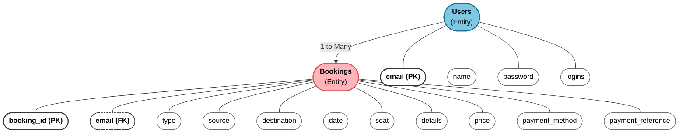
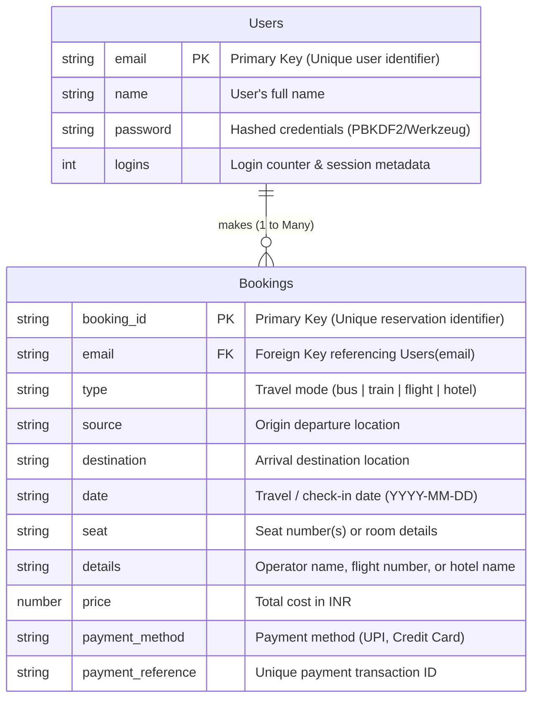

# TravelGo: Entity Relationship (ER) Diagram & Schema Design

> **Epic**: Entity Relationship (ER) Diagram  
> **Task 1**: Entity Relationship (ER) Diagram for TravelGo  
> **Database**: Amazon DynamoDB (NoSQL Cloud Database)

---

## 1. Description & Overview

The Entity-Relationship (ER) diagram models the core data structure of the **TravelGo** cloud platform. It defines the entities, their respective attributes, primary and foreign key constraints, and cardinality rules required to deliver a multi-mode cloud booking platform.

### Entities Involved:
1. **Users**: Represents individuals registered on the TravelGo platform.
2. **Bookings**: Represents individual travel or accommodation reservations (bus, train, flight, hotel) made by users.

### Primary Keys:
- **`Users`**: `email (PK)` uniquely identifies each user and serves as their primary identifier.
- **`Bookings`**: `booking_id (PK)` uniquely identifies each reservation record.

### Relationships & Cardinality:
- **Users to Bookings**: **1 to Many (1:N)**.
  - One user can initiate multiple bookings across buses, trains, flights, and hotels over time.
  - Each booking record is explicitly tied back to exactly one user via `email (FK)`.

---

## 2. Visual Entity-Relationship Diagram

### Conceptual Diagram (Matching Course Specification)

---

## 3. Relational & Schema Specification

---

## 4. Entity Attribute Dictionary

### Entity 1: `Users`
Represents individuals registered on the TravelGo platform.

| Attribute | Key Type | Data Type | Description |
|---|---|---|---|
| `email` | **Primary Key (PK)** | String | Unique email address; serves as the user's login identifier. |
| `name` | Attribute | String | Full name of the user. |
| `password` | Attribute | String | Cryptographically hashed password for secure authentication. |
| `logins` | Attribute | Integer | Number of successful logins or related session metadata. |

---

### Entity 2: `Bookings`
Captures comprehensive details for each travel or lodging reservation.

| Attribute | Key Type | Data Type | Description |
|---|---|---|---|
| `booking_id` | **Primary Key (PK)** | String | Unique booking reference code (e.g. `BK-8931-ABCD`). |
| `email` | **Foreign Key (FK)** | String | Links the booking back to the user who made it (`Users.email`). |
| `type` | Attribute | String | Booking category: `bus`, `train`, `flight`, or `hotel`. |
| `source` | Attribute | String | Origin / departure city (e.g., `Hyderabad`). |
| `destination` | Attribute | String | Destination / arrival city (e.g., `Bangalore`). |
| `date` | Attribute | String | Date of travel or hotel check-in (`YYYY-MM-DD`). |
| `seat` | Attribute | String | Assigned seat number(s) (e.g., `2A, 3A`) or room preference. |
| `details` | Attribute | String | Service provider / vehicle details (e.g., `Orange Travels`). |
| `price` | Attribute | Number | Total cost charged for the reservation in INR. |
| `payment_method` | Attribute | String | Mode of payment (e.g., `UPI`, `Credit Card`). |
| `payment_reference` | Attribute | String | Unique transaction reference identifier (e.g. `TXN-UUID`). |

---

## 5. Normalization, Integrity & Cloud Alignment

1. **Normalization & Data Integrity**:
   - The design follows standard **Third Normal Form (3NF)**:
     - User credentials and profile attributes reside strictly in `Users`.
     - Transactional reservation data resides strictly in `Bookings`.
     - Eliminates data redundancy and avoids update anomalies.
2. **Foreign Key Integrity**:
   - `Bookings.email` references `Users.email`, guaranteeing every reservation maps to a valid registered customer.
3. **DynamoDB Cloud Alignment**:
   - In Amazon DynamoDB:
     - Table `TravelGo_Users` uses `email` as its **Partition Key (HASH)**.
     - Table `TravelGo_Bookings` uses `booking_id` as its **Partition Key (HASH)**.
     - To enable instantaneous user dashboard queries without scanning, a **Global Secondary Index (GSI)** named `UserBookingsIndex` is created on `user_email` (Partition Key) + `created_at` (Sort Key).
