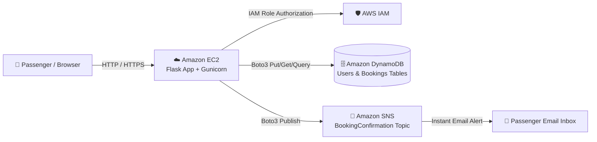
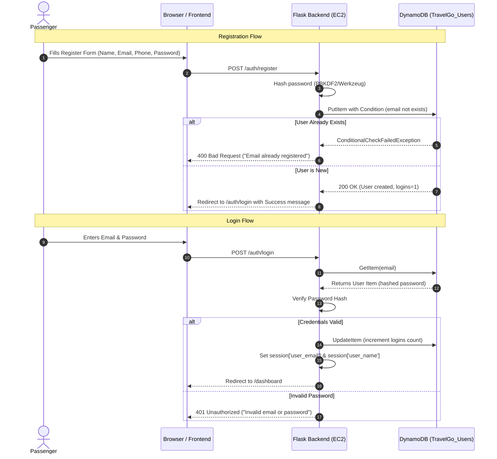
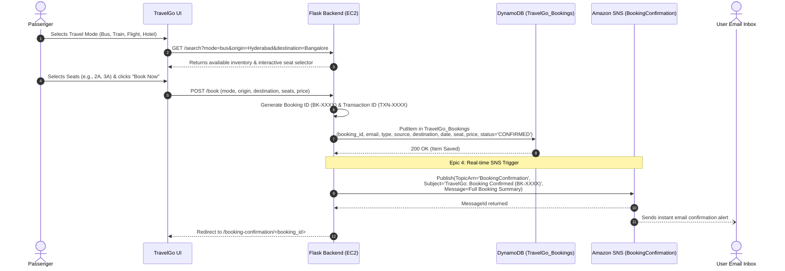
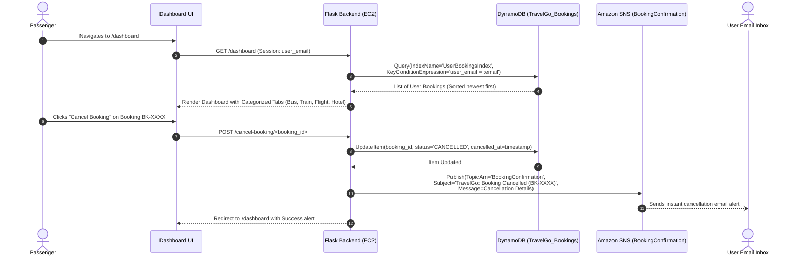

# TravelGo: End-to-End Project Flow & Architecture Sequences

> **Epic**: Project Flow  
> **Task 3**: Topic Links / Project Flow  
> **SkillWallet Course**: AWS Cloud Practitioner

---

## 1. Project Epic & User Story Roadmap

The project flow structures the implementation of **TravelGo** into 8 sequential Epics, encompassing 13 User Stories and concluding with system testing and verification:

| Epic | User Stories | Deliverable / Implementation | Status |
|---|---|---|:---:|
| **Epic 1: Backend Development and Application Setup** | • Story 1: Develop the Backend Using Flask • Story 2: Integrate AWS Services Using boto3 | [`app.py`](../app.py), [`routes/`](../routes/), [`services/aws_service.py`](../services/aws_service.py) | ✅ Completed |
| **Epic 2: AWS Account Setup and Login** | • Story 1: Set Up an AWS Account • Story 2: Log In to the AWS Management Console | [`docs/AWS_ACCOUNT_SETUP.md`](AWS_ACCOUNT_SETUP.md) | ✅ Guide Ready |
| **Epic 3: DynamoDB Database Creation and Setup** | • Story 1: Create a DynamoDB Table • Story 2: Configure Attributes for User Data and Book Requests | [`setup_dynamodb.py`](../setup_dynamodb.py), [`docs/DYNAMODB_SETUP.md`](DYNAMODB_SETUP.md) | ✅ Completed |
| **Epic 4: SNS Notification Setup** | • Story 1: Create SNS Topics for Book Request Notifications • Story 2: Subscribe Users to SNS Email Notifications | [`setup_sns.py`](../setup_sns.py), [`docs/SNS_SETUP.md`](SNS_SETUP.md) | ✅ Completed |
| **Epic 5: IAM Role Setup** | • Story 1: Create IAM Role (`TravelGo-EC2-Role`) • Story 2: Attach Policies (`DynamoDBFullAccess`, `SNSFullAccess`) | [`docs/IAM_SETUP.md`](IAM_SETUP.md) | ✅ Guide Ready |
| **Epic 6: EC2 Instance Setup** | • Story 1: Launch an EC2 Instance (Ubuntu/AL2023) • Story 2: Configure Security Groups (Ports 22, 80, 5000) | [`docs/EC2_SETUP.md`](EC2_SETUP.md) | ✅ Guide Ready |
| **Epic 7: Deployment on EC2** | • Story 1: Upload Flask Files (via GitHub clone) • Story 2: Run the Flask Application (Gunicorn + Systemd) | [`deploy.sh`](../deploy.sh), [`docs/EC2_SETUP.md`](EC2_SETUP.md) | ✅ Scripted |
| **Epic 8: Testing and Deployment** | • Story 1: Conduct Functional Testing | [`tests/test_app.py`](../tests/test_app.py) (17/17 passed), [`docs/TESTING.md`](TESTING.md) | ✅ Verified |
| **Conclusion** | • Final-Thoughts & Architectural Review | [`docs/CONCLUSION.md`](CONCLUSION.md), [`README.md`](../README.md) | ✅ Completed |

---

## 2. High-Level Architecture Flow

---

## 3. Sequence Diagram 1: User Registration & Authentication (Epic 1 & 3)

---

## 4. Sequence Diagram 2: Multi-Mode Booking & Real-Time SNS Notification (Epic 1, 3 & 4)

---

## 5. Sequence Diagram 3: Travel History Dashboard & Cancellation Workflow (Epic 1, 3 & 4)

