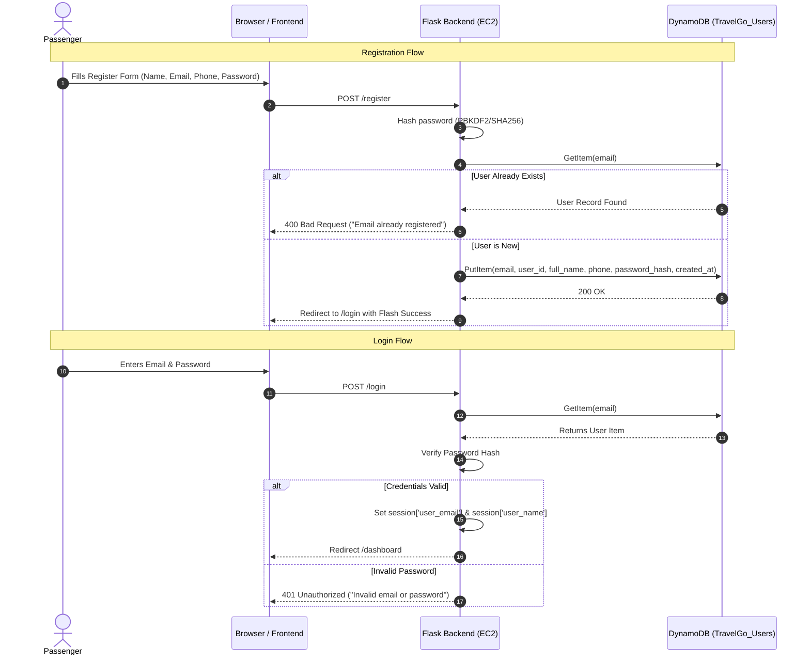
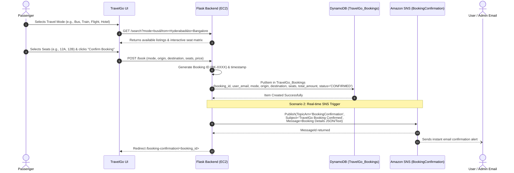
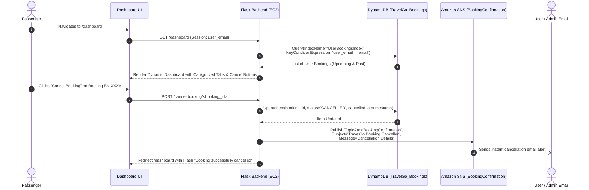

# TravelGo: End-to-End Project Flow & Architecture Sequences

> **Epic**: Project Flow  
> **Task 3**: Topic Links / Project Flow

---

## 1. System Request & Data Flow Overview

TravelGo orchestrates three primary AWS components around a Python Flask web core:
1. **Amazon EC2**: Hosts the Flask backend service behind a reverse proxy/WSGI server.
2. **Amazon DynamoDB**: Provides millisecond key-value and document persistence for user credentials and booking history.
3. **Amazon SNS (Simple Notification Service)**: Dispatches instant booking and cancellation alerts to subscribers via the `BookingConfirmation` topic.

---

## 2. Sequence Diagram 1: User Registration & Authentication

---

## 3. Sequence Diagram 2: Multi-Mode Booking & Real-Time SNS Notification (Scenario 1 & 2)

---

## 4. Sequence Diagram 3: Travel History Dashboard & Cancellation Workflow (Scenario 3)

